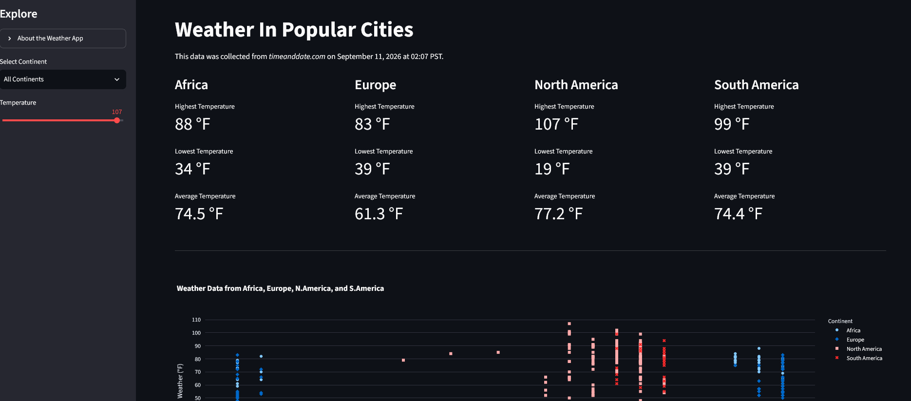

# Weather of Popular Cities

## Overview

The Weather Streamlit App is showing the Weather(temperature) of the Popular city in Africa, Europe, North America ,and South America. The time and date the weather snapshot was taken is stated on the sub header of the App.

## Run it on your computer

- You will first have to clone the repo
- set up and activate your venv (environment).
- run `pip install -r requirements.txt` to install the packages
- execute `index.py ` script and this will return a `weather_data.csv`
- execute `clean_weather_data.py ` script and this will return a `cleaned_weather_data.csv`
- execute `weather_sql.py ` script and this will create a sqlite DB and save it in `db/weather_data.db`
- Run `streamlit run weather_streamlit_app.py` script to display the result on the browser

## Future Plan

- Adding the other Continent popular cities weather
- Update the Weather once a day ( create a cron job)

